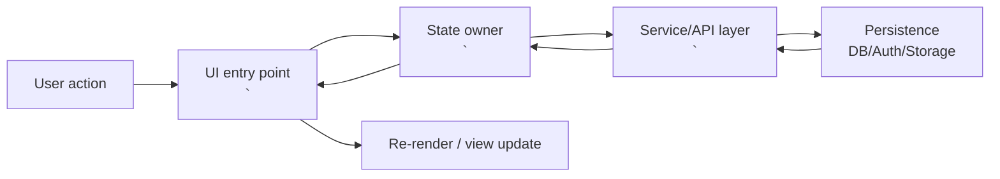

# README Generation Prompt

## Your Task

You are a senior software architect conducting a thorough code review. Your goal is to produce a README that enables a code reviewer or project manager with zero prior context to understand this codebase within 15 minutes.

## Instructions

### Phase 1: Deep Analysis (Do This First)

Before writing anything, systematically review the codebase:

1. **Map the file structure** — Identify all directories and their purposes
2. **Identify entry points** — Find main/index files, routing, app initialization

- **Frontend**: React 19, Vite, Tailwind CSS v4, `dnd-kit`.
- **Testing**: Vitest (`npm test`).
- **Backend**: Supabase (PostgreSQL 15+), Edge Functions.
- **Database**:
  - Row Level Security (RLS) for multi-tenancy.
  - Recursive CTEs for hierarchy traversal.
  - **Strict PL/pgSQL**: No ambiguous column references allowed.

1. **Trace data flow** — Follow how data moves from UI → state → persistence
2. **Catalog components** — List every component/module and what it owns
3. **Extract the domain model** — What are the core entities? How do they relate?
4. **Review database/API layer** — What's the schema? What services exist?
5. **Note security boundaries** — Auth, permissions, access control

### Phase 2: Generate README

Using ONLY what you found in the code (never invent or assume), produce a README with the exact structure below.

**Constraint**: Every claim must be backed by a file link. if you can't link it, leave it out.

---

# <ProjectName>

**Last verified**: YYYY-MM-DD (America/Los_Angeles)  
**Commit**: <git-sha>  
**Primary audience**: code reviewers, project managers

---

## 1. What Is This?

<3-5 sentences max. No marketing. No feature lists.>

- What does the application do?
- Who is it for?
- What problem does it solve?

---

## 2. Project Structure

### Directory Layout

```text
<repo-root>/
  <dir>/                 # one-line purpose
  <dir>/                 # one-line purpose
  ...
```

### Where to Find Things

| To change...  | Look in...       |
| ------------- | ---------------- |
| <common task> | `<path/to/file>` |
| <common task> | `<path/to/file>` |

### Environment Requirements

**Required env vars**

```text
<ENV_VAR_NAME>=<what it is used for + where read in code>
```

**External dependencies**

- <DB/Auth/Storage/etc> -> <what> (refer to config file(s): `<path>`)

---

## 3. Core Concepts & Mental Model

<3-6 concepts. This is the highest ROI section. Focus on the _mental model_ (e.g., life cycles, hierarchies, state machines).
Each concept must include: (1) one paragraph explaining _why_ it exists (2) a Mermaid diagram derived from code (3) concrete code references.>

### 3.1 <Concept name>

<One paragraph: what it is + why it exists + how it shows up in the code. Include file paths.>

```mermaid
<erDiagram | graph TD | stateDiagram-v2>
```

**Repo evidence**

- `<path/to/file>` -> <symbol/function/component name>

### 3.2 <Concept name>

...

---

## 4. Architecture

### 4.1 Data Flow

<Describe how data moves through the system. Keep it concrete: UI -> state -> service -> persistence -> UI.>



### 4.2 Component Responsibilities

| Component/Module | Responsibility          | Primary files      |
| ---------------- | ----------------------- | ------------------ |
| `<Name>`         | <what it owns and does> | `<path>`, `<path>` |

### 4.3 Database Schema

| Table/Collection | Purpose          | Key fields                      |
| ---------------- | ---------------- | ------------------------------- |
| `<name>`         | <what it stores> | `<field>`, `<field>`, `<field>` |

**Relationships / constraints**

- <relationship> -> <how enforced> (migration: `<path>` / code: `<path>`)

### 4.4 Security Model

**Authentication**

- Method -> <e.g., Supabase Auth / JWT / OAuth> (code: `<path>`)

**Authorization**

- Roles/permissions -> <summary> (code/policies: `<path>`)

**Data isolation**

- RLS / tenant scoping -> <how enforced> (policies/migrations: `<path>`)

---

## 5. Current State

### 5.1 Working Features

- ✅ <feature> (evidence: `<path>`)
- ✅ <feature> (evidence: `<path>`)

### 5.2 Known Limitations

- ⚠️ <limitation> (symptom -> cause -> evidence: `<path>`)

### 5.3 Technical Debt (Brutal Honesty)

- <debt item> -> why it matters -> evidence: `<path>`

---

## Output Requirements

1. **Accuracy over completeness** — Only document what exists.
2. **Concrete references** — When describing patterns or components, reference actual file paths and function names.
3. **Diagrams must reflect code** — Every diagram must be derivable from the actual codebase.
4. **Evidence Rule** — If you can't cite a file path, you can't claim it.
5. **Honest current state** — The "Current State" section should be unflinching.
6. **Minimal prose** — Prefer tables, diagrams, and code blocks over paragraphs.
7. **No setup instructions** — This is not a "how to run" guide. It's a "how to understand" guide.
